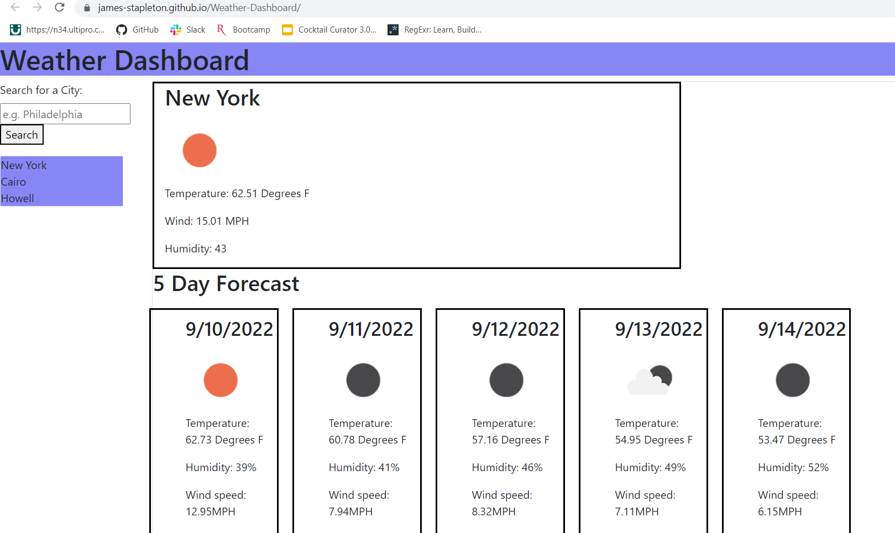

# Weather-Dashboard

## Description

This is a website that allows a user to search for any city in the world and recieve both current weather information as well as a 5-day weather forecast. The user simply types the name of the desired city in the search bar, clicks search and then is presented the data in an easy-to-read format. In addition, when the user searches for a new city, it is added to a search bar. The search bar allows the user to click on a city they have previously searched for in order to make another request to the API for weather information. This search history is saved in local storage so that it will persist between sessions. 

## Links

Repo:

https://github.com/james-stapleton/Weather-Dashboard

Deployed:

https://james-stapleton.github.io/Weather-Dashboard/

## Screenshot

